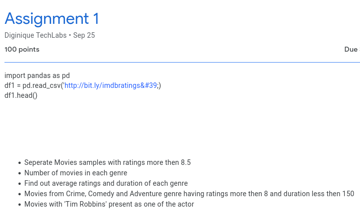

<h3 id="myHeading">Playing with .csv files </h3>

**I was given an assignment, I had to use pandas to extract some info from a imdb.csv file.**

*You can see the assignment below :*

---

But, as I am learning about unix/linux.
*I thought...* 
 
:bulb: **Why not do it on bash?!**

And, here we are ...

---

Before going through the steps, here are some links:
 
**[genAnswers.sh](https://github.com/RohitSingh496/playingwith-csvfiles/)**
- Bash script to generate all answers in one go.

To execute the script, type in your terminal:

` bash genAnswers.sh `

:memo: The script requires the *imdb.csv* and *csv2tab* files to be in the *same* directory. Download them [here.](https://github.com/RohitSingh496/playingwith-csvfiles/)

If you want to test or edit something, you can clone the project via: 
- Download and extract the zip, or
- just type in you terminal:

` git clone https://github.com/RohitSingh496/playingwith-csvfiles.git `

---

<h4 id="">The steps I followed were: </h4>

1. Since, files separated by comma(,) are hard to use with commands like awk or sed.
   I decided to convert to a tsv or tab-separated file.  
   As for why csv files don't work very well with awk or sed.[See Here](#myHeading)

2. Now, to convert a csv to tsv, you can use your spreadsheet software or cli tool. In my case,
   I used a simple python script with csv module. [Link Here](https://github.com/RohitSingh496/playingwith-csvfiles/blob/master/csv2tab)  
   To use the script just cat out the csv and pipe it to the script and save it to a new file:  
   `cat imdb.csv | ./csv2tab > imdb.tsv`

3. 
 - :memo: $4 is genre field.
 - :memo: $1 is ratings field.
 - :memo: $5 is duration field.
 
 - Separate Movies samples with ratings more than 8.5 . 
    `awk -F'\t' '$1>8.5 {print}' imdb.tsv > separated.tsv`

---

 - Number of Movies in each genre? 
     Get a list of all the genre and save to genrelist txt file:   
     `awk -F'\t' '{print $4}' imdb.tsv | sort | uniq > genrelist`
 
     Now, count movies in each genre:  
     `grep -ic 'Genre' imdb.tsv`
 
     Or, to do it all in one go: 
     `while IFS= read -r line; do value=$(grep -ic $line imdb.tsv) ; echo "$line | $value" ; done < genrelist`

     *The output will look like this:*

---

 - Find out average ratings and duration of each genre.

	Since, we already have the total number of movies in each genre.
	To find average ratings and duration, we just need to find the sum of ratings and duration in each genre.
	And, divide by the total number of movies in the respective genre.

	To find sum of ratings: 
	`grep -i 'Genre' imdb.tsv| awk -F't' -v sum=0 'sum+=$1{} END {print sum}'`

	Now, instead of manually inputting each genre, we can use the genrelist file which has all the genre names inside a while loop
	and store in a rating.txt file for further use.

	`while IFS= read -r genre;do grep -i "$genre" imdb.tsv | awk -F'\t' -v sum=0 'sum+=$1{} END{print sum}'; done <genrelist >rating.txt`

	Same for duration:(the fifth field) , save the durationSum in a duration.txt file.  
	`while IFS= read -r genre;do grep -i "$genre" imdb.tsv | awk -F'\t' -v sum=0 'sum+=$5{} END{print sum}'; done <genrelist >duration.txt`
	
	Now to find the average, we create 3 arrays, 1 from rating.txt, 2 from duration.txt and 3 from genreSum.txt  
	`mapfile -t ratings < rating.txt`  
	`mapfile -t durations < duration.txt`  
	`mapfile -t nums < genreSums.txt`  

	now, average = ratings/nums or durations/nums respectively.
	
	To do this in code...
	
	find the length : `echo ${#ratings[@]}`  
	which results in 17, this should be same for all 3 arrays, as they all have 17 genre. 

	`for i in {0..16}; do
       		echo "scale=2; ${ratings[i]}/${nums[i]}" | bc
	;done`
	
	for average Duration replace ratings with durations ,redirect to a text file to keep the data.

---

 - Movies from Crime, Comedy and Adventure genre having ratings more than 8 and duration less than 150

    `cat imdb.tsv | awk -F'/t' '$1>8 && $5<150 && ($4 ~ /Crime/ || $4 ~ /Comedy/ || $4 ~ /Adventure/){print}'`

---

 - Movies with 'Tim Robbins' present as one of the actor

    `grep -i "Tim Robbins" imdb.tsv`

     To search in actors field specifically, use awk: 
    `awk -F'\t' '$6 ~ /Tim Robbins/ {print}' imdb.tsv`

